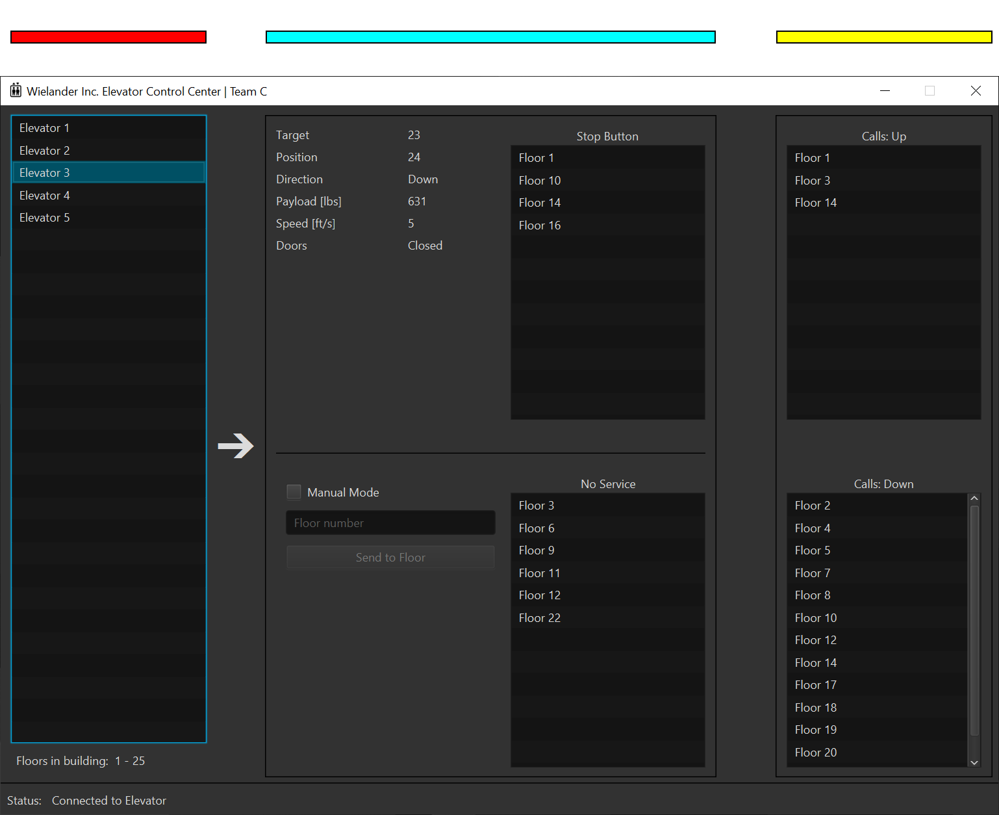

# Elevator Control Center: Team C

[](https://sonarcloud.io/dashboard?id=fhhagenberg-sqe-esd-ws20_elevator-control-center-team-c)


## Team
- Florian Atzenhofer (s1910567001)  
- Lukas Ebenstein (s1910567015)  
- Stefan Wohlrab (s1910567010)  


## GUI overview
The following picture should give an overview of the different parts of the GUI. The colors mark the different sections of the GUI.  
Click [here](https://github.com/fhhagenberg-sqe-esd-ws20/elevator-control-center-team-c/raw/Documentation/doc/includes/GUI-explanation.png) to see the image in full resolution.  

1. Red: On the left side there is a list showing all elevators in the building. After clicking on one of the elevators in the list the middle section, market in cyan, shows all information about this elevator. At the bottom there is also the list of floors in the building.  
2. Cyan: All information about the elevator. On the left side in this section the manual mode can be enabled for this elevator. The right side of this section shows the stop buttons pressed inside the elevator and which floors the elevator does not service.  
3. Yellow: This section applies to all elevators in the building. Calls up and down are valid for all elevators.  

At the bottom of the window the latest status/error message is shown.




## How to download and run
### Prerequisites
1. Working installation of Java SE/JDK version >=11 (major version >=55)  
2. Working installation of Maven 3
### Standalone jar
Download standalone jar from included assets from [latest release](https://github.com/fhhagenberg-sqe-esd-ws20/elevator-control-center-team-c/releases/latest).

### Build your own
Download the code and open the project in eclipse (or adapt the project to your IDE). Make sure Maven is installed and working correctly.
#### Relevant Maven commands
- Run: ```clean javafx:run```  
- Generate code coverage: ```verify```  
- Build standalone jar: ```clean compile assembly:single```  

## Test concept
```TODO```: Was war Whitbox, Blackbox, Unit testing, integration testing?  

We used multiple test files that cover different areas of our program. Most of the tests use the TestFx test framework with Mockito.  
All tests can be categorized in the following categories.  
- Unit tests: 
- Controller-GUI tests: 
- End-to-End tests: 
- ...

### Coverage of classes by testfile
Click ```here``` to see the image in full resolution.  
Click ```here``` to see the class diagram without markings and in full resolution.  


